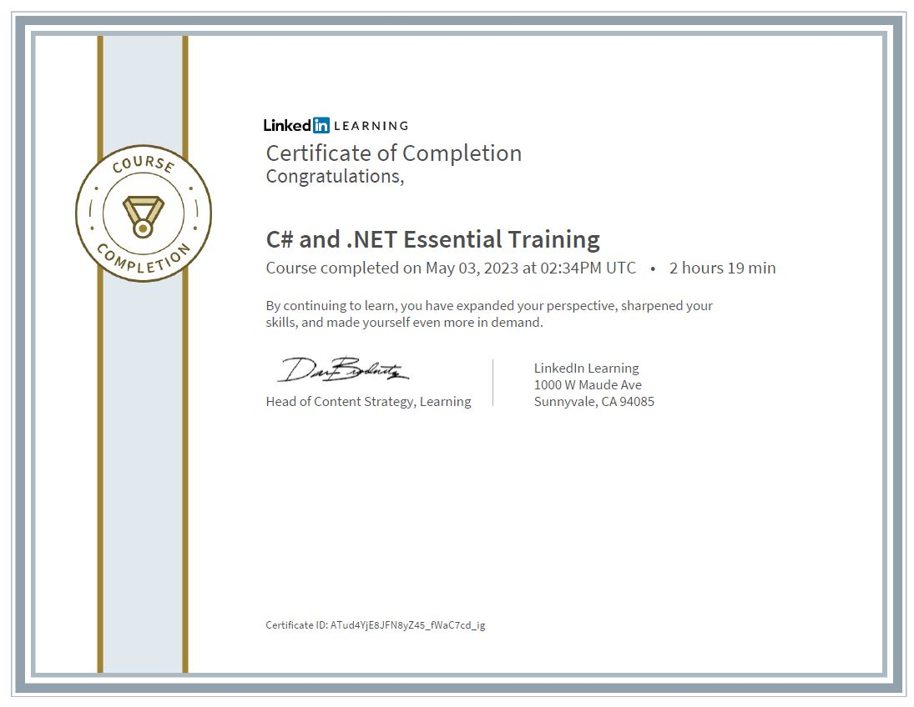

# C# and .NET Essential Training

This is the repository for the LinkedIn Learning course C# and .NET Essential Training. The full course is available from [LinkedIn Learning][lil-course-url]. <br>

</img> <br>
Microsoft .NET is a modern, cross-platform framework for developing applications for the web, desktop, and mobile devices. This course gives an introduction to some of the features of .NET that makes building applications easier, more performant, and more productive. Veteran technologist Joe Marini demonstrates how to use built-in capabilities of .NET such as string processing, data collection types, number and date formatting, reading and writing files, and even working with regular expressions. By using these built-in features, developers can focus on their core application logic and less on having to build common capabilities from scratch.

## Instructions

This repository contains the example files code for the course. Clone or copy this repo to your computer and use your favorite text editor to work with them.

Make sure you install .NET 6; these project files were built to work with that version of the .NET framework.

## Installing

1. To use these exercise files, you must have the following installed:
   - .NET Framework 6
   - A text editor that you like
   - A terminal program like PowerShell or Terminal
2. Clone this repository into your local machine using the terminal (Mac), CMD (Windows), or a GUI tool like SourceTree.

### Instructor

Joe Marini

Senior Director of Product and Engineering

Check out my other courses on [LinkedIn Learning](https://www.linkedin.com/learning/instructors/joe-marini).

[lil-course-url]: https://www.linkedin.com/learning/c-sharp-and-dot-net-essential-training

## My Classnotes 🙋‍♀️:

#1-3 .NET garbage collection <br> - The .NET platform manages and reclaims blocks of memory <br> - Performs efficient allocation on the application "heap" <br> - Happens automatically, as you don't have to manually release memory <br> - Few exceptions, like operating system resources (files, network connections)

```C#
GC.Collect();
```

In line19, never need to do this in our app, this functio is provided for mainly testing purposes. This is only for demonstration purposes.

#1-2 Basic string formatting
indexes: "{0},{1}",var1,var2
interpolation: $"{var1},{var2}"
Formatting: $"{var1, [alignment]:[format][precision]}"
#2-4 Searching

- IndexOf() - returns the index of the first occurrence of a substring
- LastIndexOf() - returns the index of the last occurrence of a substring
- StartsWith() - returns true if the string starts with the specified substring
- EndsWith() - returns true if the string ends with the specified substring
- StartsWith("", StringComparison.CurrentCultureIgnoreCase) - returns true if the string starts with the specified substring, ignoring case

#3-2 Formatting numerical data
General format is {index[,alignment]:[format]}
Common types are N (Number), G (General), F (Fixed-point),
E (Exponential), D (Decimal), P (Percent), X (Hexadecimal),
C (Currency in local format)

```C#
Console.WriteLine($"{val1:D}, {val1:N}, {val1:F}, {val1:G}");
Console.WriteLine($"{val2:E}, {val2:N}, {val2:F}, {val2:G}");
```

Add a number after the format to specify precision

```C#
Console.WriteLine($"{val1:D6}, {val1:N2}, {val1:F1}, {val1:G3}");
```

check more detail on `standard numeric format strings` on Microsoft Docs

#4-1 CreateFiles
Use the **"using" construct** to automatically close a file when done and associated file reference when this Using context block completes.
Files are one of those operating systme resources that the garbage collector can automatically close for us.

#4-4 Enumerating files and directories
**EnumerateDirectories**() is a recursive function that will return all the directories in a given path, including all subdirectories.
**EnumerateFiles**() is a recursive function that will return all the files in a given path, including all subdirectories.
**EnumerateFileSystemEntries**() is a recursive function that will return all the files and directories in a given path, including all subdirectories.

#5 regex .NET

- Finding patterns: IsMatch(), Match(), Matches()<br>
  **isMatch**() returns boolean <br>
  **Match**() returns what the actual matches are <br>
  **Matches**() returns a collection of matches <br>
- Replacing patterns: Replace()
- Regex timeouts: Regex.InfiniteMatchTimeout, Regex.InfiniteMatchTimeout
  since regular expressions are not one of the default name spaces included in every project, I have to explicityly include the regular expression at the top of the file.

  ```C#
   using System.Text.RegularExpressions;
  ```

  #5-4 RegexMatchTimeoutException

- Exception handling: try/catch/finally
- Regex.MatchTimeoutException is thrown when a regular expression pattern exceeds a specified time-out interval.
